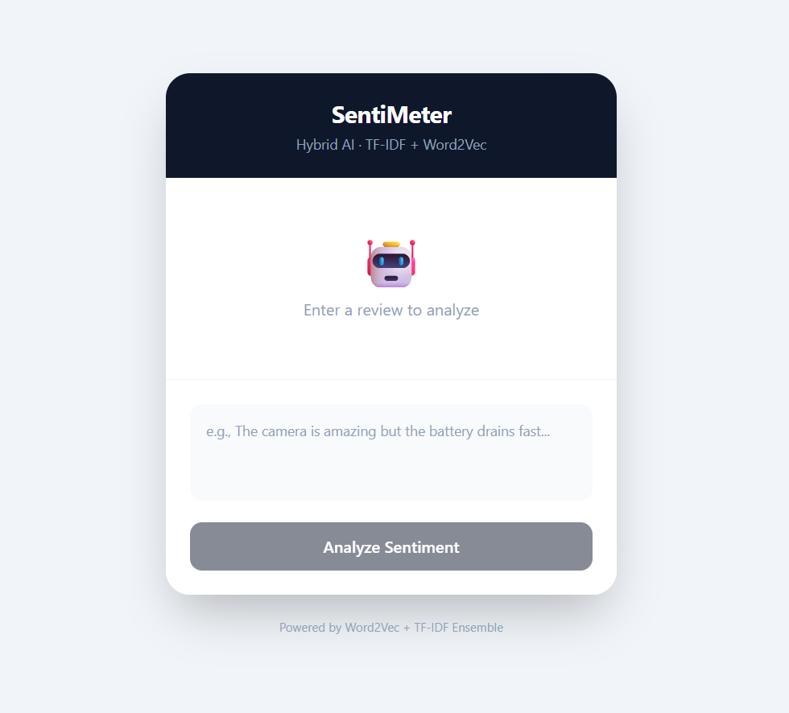

# Apple vs. Samsung: Sentiment Analysis

##  Overview

This project compares **Syntactic (TF-IDF)** and **Semantic (Word2Vec)** approaches to classify sentiment in ~14,000 mobile reviews. A **Hybrid Ensemble** model combines both for optimal accuracy.

## 📸 Interface



##  Project Structure

```
├── Apple_vs_Samsung_Sentiment_Analysis.ipynb  # Original Analysis
├── Mobile Reviews Sentiment.csv               # Dataset
├── train_and_save.py                          # Hybrid Model Training
├── models.joblib                              # Saved Ensemble Model
├── server.py                                  # Flask Backend API
├── client/                                    # React + Tailwind Frontend
│   ├── src/App.jsx                            # Main UI Component
│   └── ...
└── README.md
```

##  Quick Start

### 1. Train Models (Optional - already trained)
```bash
python train_and_save.py
```

### 2. Start Backend
```bash
python server.py
```

### 3. Start Frontend
```bash
cd client
npm install
npm run dev
```
Open `http://localhost:5173`

##  How It Works

1. **Preprocessing:** Text cleaning (lowercasing, removing URLs, handling contractions, negation handling, lemmatization)
2. **Model A (Syntactic):** SVM + TF-IDF (15 features)
3. **Model B (Semantic):** SVM + Word2Vec (32-dim embeddings)
4. **Ensemble:** Average probabilities from both models
